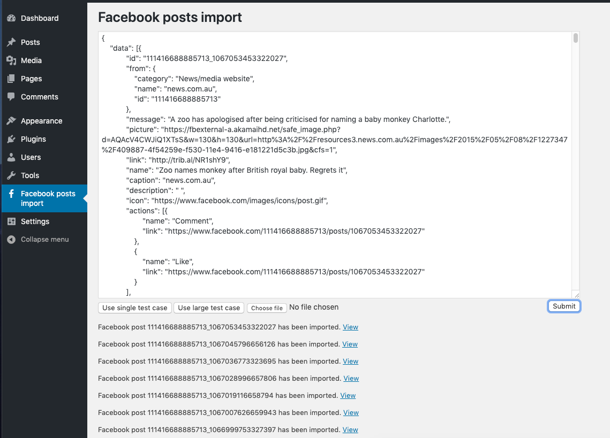
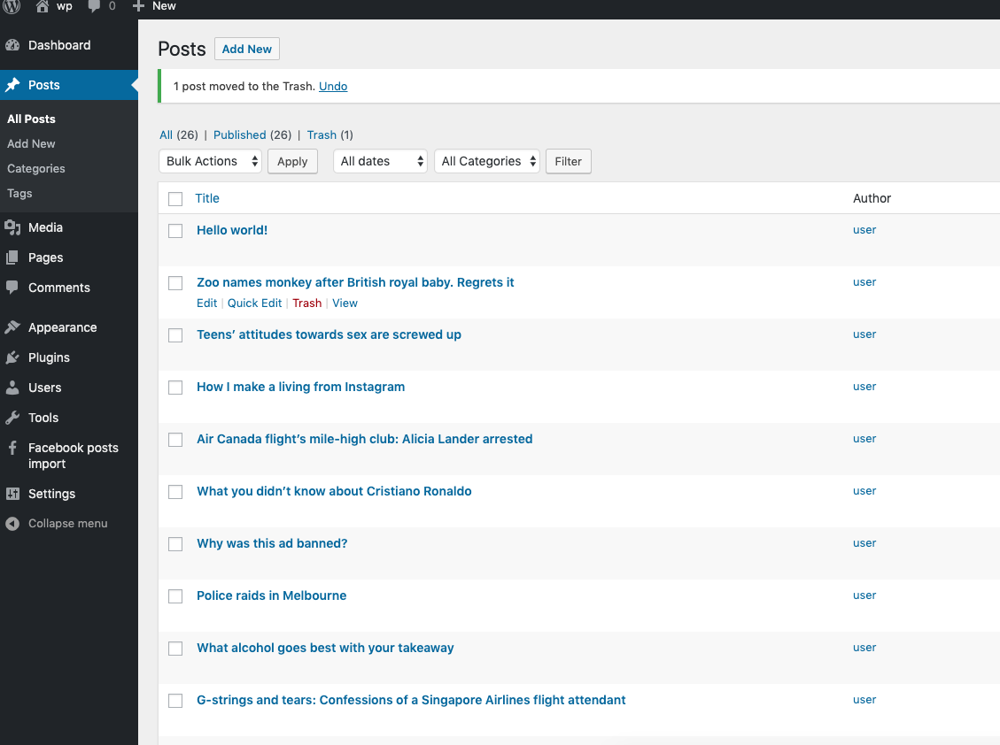
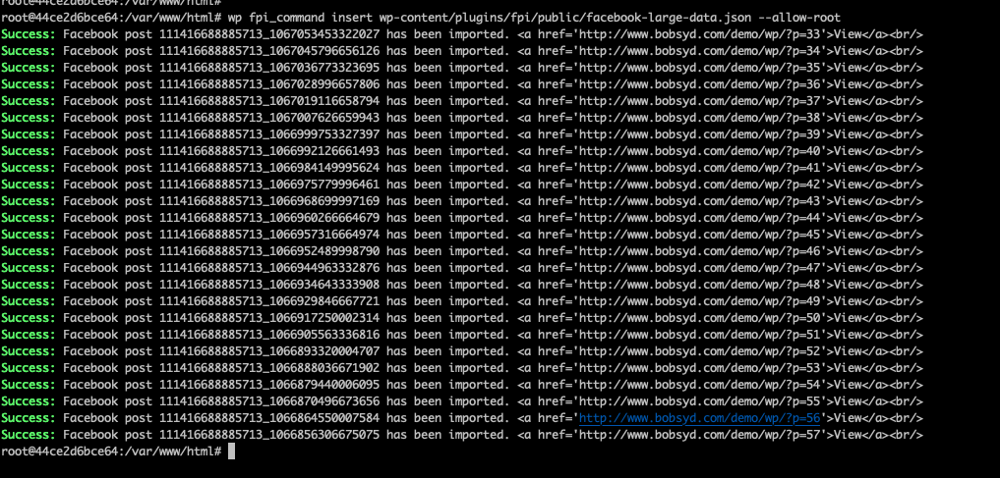

# Facebook import plugin  

## Requirement
Using data from the Facebook Graph API, create your own WordPress plugin that will retrieve the posts from a Facebook page and import them into a WordPress site as posts.

## TODO
* If you had to import 100,000 Facebook posts in a few minutes?  
    * In that case I will try to loop the json data before sending ajxe call, with a loop using Promise to send 100,000 requests asynchronously
* How to validate the import data
    * I was trying to write a long json schema to validate the import date , however I found all posts have an attribute "name" except (id=111416688885713_1066952489998790), which has an attribute called "story" instead. Need more time on documents 
    * For this project I just validate some key attributes       
* Layout style
* Connect to Facebook Graph API directly , instead of using a json file.
* All image url expired, so store the image locally while connecting to API.

## Tech
* Plugin template from https://wppb.me/
* WP Cli
* PHPUnit

## Usage
* After activate the plugin you can see a new menu item in sidebar
* ``` wp fpi_command insert {json_file_path} ``` 

## Screenshot





